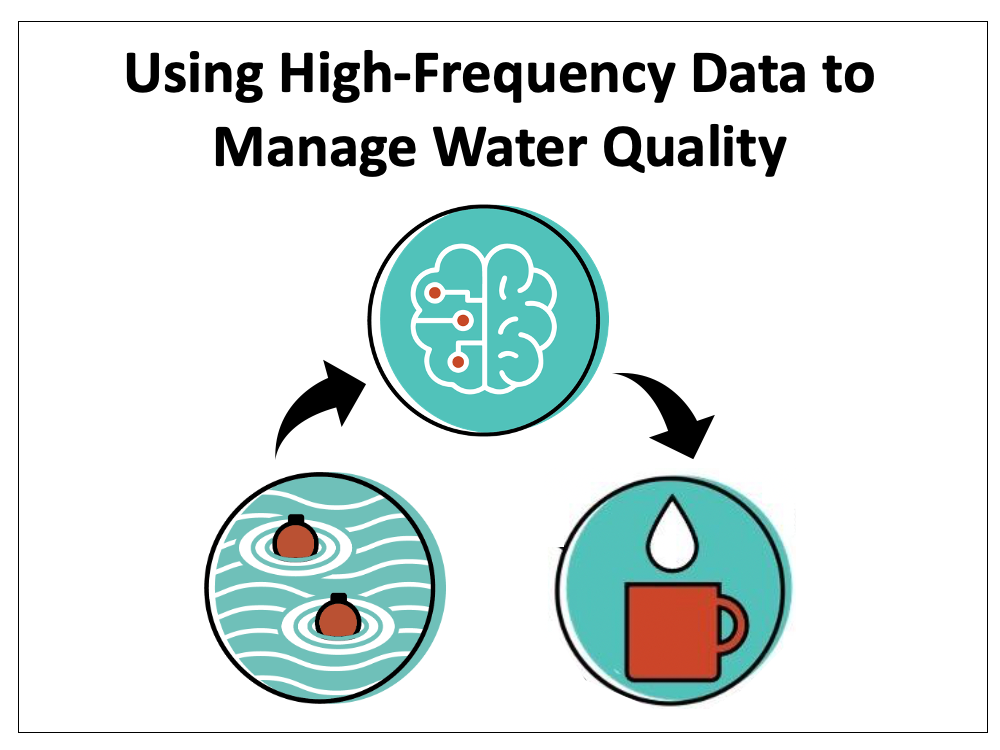

<!-- -->

# [Macrosystems EDDIE](https://serc.carleton.edu/eddie/macrosystems/index.html)

## Module 9: Using High-Frequency Data to Manage Water Quality

 

### Summary
This branch contains the `paper.md` and `paper.bib` files associated with a [Journal of Open Source Education (JOSE)](https://jose.theoj.org/) submission of Macrosystems EDDIE Module 9: Using High-Frequency Data to Manage Water Quality

## Questions & Feedback
If you have any questions, comments or feedback related to these materials you can send an email to [macrosystemseddie@gmail.com]().
 
